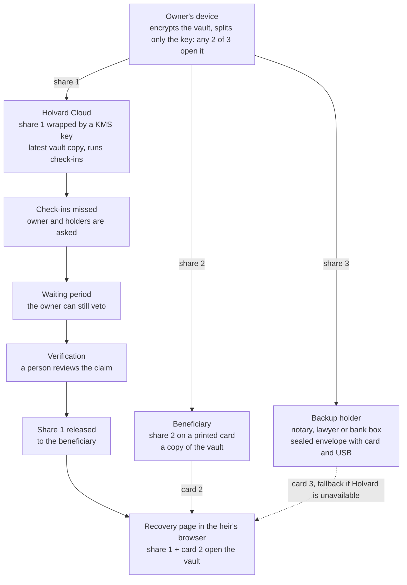

<!--
SPDX-FileCopyrightText: 2026 Holvard contributors
SPDX-License-Identifier: CC-BY-4.0
-->

# Holvard design

**Status: draft, design phase.** Nothing here is final until format
version 1 of the specification is published. Comments and criticism are
welcome as issues.

## Overview

Holvard makes sure the right people can reach a person's important
information when that person no longer can: instructions, accounts, where
funds and investments are, documents, contacts and credentials.

The owner encrypts a vault on their own device. Its key is split so that
any two of three holders can open it: Holvard Cloud (the hosted keeper
service), a beneficiary, and a backup holder such as a notary.

**The guarantee:** Holvard alone can never open a vault. Opening it takes
two holders working together, and Holvard takes part only through the
owner's release policy.

## How it works

1. **The owner creates the vault** on their own device. It is encrypted
   with [age](https://github.com/C2SP/C2SP/blob/main/age.md) under a random
   256-bit secret from the operating system's random generator. The secret
   is never derived from a password.
2. **Only the secret is split**, with
   [SLIP-39](https://github.com/satoshilabs/slips/blob/master/slip-0039.md),
   2-of-3:
   - **Holvard Cloud** keeps share 1, wrapped by a KMS key, plus the latest
     copy of the encrypted vault.
   - **The beneficiary** keeps share 2 on a printed card (QR code and
     words) and a copy of the vault.
   - **The backup holder** keeps share 3 in a sealed envelope, with a USB
     copy of the vault and the offline recovery page.
   The owner keeps the full secret to edit the vault.
3. **While the owner is active**, they check in periodically. Editing the
   vault re-encrypts it under the same long-lived secret, so the cards stay
   valid; age itself picks a fresh internal file key on every encryption.
4. **When check-ins stop**, Holvard Cloud follows the owner's release
   policy: holders are contacted, a waiting period starts in which the
   owner can still veto, and a person reviews the evidence a claim
   provides.
5. **On release**, Holvard Cloud gives share 1 to the beneficiary. The
   beneficiary combines it with their own card in the recovery page from
   their kit, which runs offline in the browser. Holvard never sees the
   card or the vault's contents, as long as the recovery page comes from the
   kit or a signed release (see "The browser is a trust boundary").
6. **Without Holvard**, the beneficiary and the backup holder can recover
   together, with no involvement from Holvard at all.

### The backup holder

The backup holder needs no relationship with Holvard. Any notary, lawyer
or bank safe deposit box can keep the sealed envelope. The backup holder
must be independent of the beneficiary (see below), so the tools warn when
a family member is given that role.

### Other thresholds

Version 1 supports only 2-of-3, but the format allows any SLIP-39
threshold and group structure from the start, for example:

| Group | Members | Needed |
| --- | --- | --- |
| Heirs | 3 children | 2 of 3 |
| Holvard | Holvard Cloud | 1 of 1 |
| Backup | Notary, lawyer or bank box | 1 of 1 |
| Rule | | Any 2 of the 3 groups |

- Fewer shares needed than exist means more cards can be lost: 3-of-5
  survives two lost cards, 5-of-6 only one.
- Thresholds will be offered as presets, and every setup will be shown in
  plain words: who could open the vault without Holvard, and how many
  cards may be lost.
- A SLIP-39 group with threshold 1 must have exactly one member, so
  "Holvard or notary" is built as two one-member groups.

## What Holvard can and cannot promise

Any two holders can open a vault, at any time. Verification governs only
Holvard's cooperation; it does not cryptographically stop two other holders
from acting early.

| Holders together | Can they open the vault? | What stands in the way |
| --- | --- | --- |
| Holvard + beneficiary | Yes | Holvard's release policy. This is the normal path. |
| Beneficiary + backup holder | Yes, at any time, without Holvard | Only their independence from each other |
| Holvard + backup holder | Yes, without the beneficiary | Holvard's policy and the backup holder's legal duty |
| Any single holder | No | One share reveals nothing |

- **Groups don't remove this.** In the group example above, Holvard plus
  the backup holder still opens the vault without any of the heirs.
- **The browser is a trust boundary.** A service that delivers the code
  running in the owner's browser could deliver modified code that captures
  the owner's secret. Owner-side encryption therefore runs in the CLI
  first; any browser app will ship as signed, reproducible static releases
  from a separate origin, never served by the keeper server.
  The recovery page follows the same rule. It combines share 1 with the
  heir's card, so code Holvard served there could capture the card and give
  Holvard two shares. It ships only as a signed, reproducible static
  release, never from holvard-server; the offline copy in the kit is the
  preferred path, and practice drills use only that copy.
- **KMS wrapping and decrypt alerts limit damage; they do not enforce
  verification.** The keeper's API can only encrypt shares, a separate
  release worker can only decrypt them, every decrypt alerts the owner and
  all holders, and each wrapped share is bound to its vault ID. The release
  worker, policy signatures and account recovery are reviewed together, as
  one system.

## Changes over time

New shares of the same secret do not revoke old ones: two old cards still
open the vault. Only a new secret does, and copies of the vault that were
already made can never be taken back.

| Event | What happens |
| --- | --- |
| The owner loses their device | The owner restores the full secret from their own backup, such as a password manager. Without one, two holders can help. |
| A beneficiary or holder is replaced, or becomes estranged | New secret, vault re-encrypted, new cards for everyone; old envelopes and vault copies are collected and destroyed where possible. Copies already made stay readable with the old cards. |
| A card is lost | One card alone is harmless. If it could reach someone holding another card, the secret is rotated as above. |
| An old USB copy surfaces | Every vault carries a version number and date, and the recovery page shows which version it opened. |
| The subscription lapses | Open question: a grace period with reminders, then Holvard either keeps or deletes its share. Beneficiary plus backup holder always remains a path. |
| Holvard becomes unavailable | Beneficiary plus backup holder recover without Holvard. A published continuity plan names a successor for the stored shares. |

## Components and licenses

| Component | What it does | License |
| --- | --- | --- |
| Format spec (`spec/`) | Card format, vault file format, step-by-step recovery | CC-BY-4.0 |
| Test vectors (`test-vectors/`) | Sample cards and vaults with expected results | CC0-1.0 |
| `holvard-core` | Secret generation, encryption with age, SLIP-39 split and combine, card encoding | Apache-2.0 OR MIT |
| `holvard` CLI | `init`, `split`, `cards`, `recover`, `seal` | Apache-2.0 OR MIT |
| Recovery page | One offline HTML file with camera QR scanning, checked against the test vectors; a copy in every kit, online only as a signed static release | Apache-2.0 OR MIT |
| `holvard-server` (later) | The keeper: shares, vault copies, check-ins, waiting period, veto, claims | AGPL-3.0-only |
| Mobile apps (later) | Native apps on the same core | Apache-2.0 OR MIT |

Contributions are accepted under the Developer Certificate of Origin
(signed-off commits). Every file carries an SPDX header.

## Technical decisions

**Decided**

- Encryption happens on the owner's device; the secret comes from the
  operating system's random generator and is 256 bits long.
- Shares use SLIP-39 as specified, including the 2024 "extendable backup"
  flag. The implementation is Holvard's own and must pass the reference
  test vectors from Trezor's
  [python-shamir-mnemonic](https://github.com/trezor/python-shamir-mnemonic).
- Cards carry a QR code, the SLIP-39 words, the format version and a
  vault fingerprint. Format version 1 is frozen once published; later
  versions only add.
- Every vault Holvard writes must open with the official age tool, and
  every card set must recover with the SLIP-39 reference implementation.
  Both directions are checked in CI.
- The hosted service keeps customer data with non-US providers.
- The server is multi-tenant, with pluggable key protection: a cloud KMS,
  OpenBao Transit, or a local key for small self-hosted setups.
- Weakening a release policy requires the owner's signature from the
  client and takes effect only after a delay, with all holders notified.

**Open**

| Question | Current leaning |
| --- | --- |
| How the split secret unlocks the age file: an X25519 identity or an age passphrase | Passphrase: purely symmetric, and any age tool can recover without Holvard |
| SLIP-39 words exist only in English | Instructions in the holder's language on the card; autocomplete (never auto-correct) in the recovery page |
| What happens to Holvard's share when a subscription lapses | See "Changes over time" |

## How AI is used in development

Much of the code is written with AI assistance. These rules apply:

1. No home-made cryptography: only established libraries (age, RustCrypto,
   the operating system's random generator).
2. Independent implementations are the acceptance test: age and the
   SLIP-39 reference, in both directions, in CI.
3. A small core: no network access, no `unsafe`, strict lints, dependency
   and advisory checks on every change.
4. Every change is reviewed by a human maintainer before it merges.
5. AI-assisted commits are marked as such in the commit message.
6. An independent security review of the threat model and specification
   happens before the format is frozen, and of the implementation before
   real vaults are accepted.

## Prior art

Holvard builds on ideas that others have explored:

- [ReMemory](https://github.com/eljojo/rememory) encrypts files with age
  and splits the passphrase among friends with Shamir secret sharing, with
  printable holder bundles, QR codes and an offline recovery page. It has
  no keeper service and uses its own share format.
- Password managers (Proton, Bitwarden and others) offer emergency access
  after a waiting period, without split keys.
- Bitcoin custody services (Casa, Unchained, Bitkey) hold one of three
  keys and release after a claim window the owner can cancel. Holvard
  applies the same model to documents and instructions.
- SecureSafe offers a release started by an appointed activator, often a
  solicitor, with a blocking period the owner can use to stop it.

What Holvard adds is the combination: standard SLIP-39 cards, group
thresholds, an independent keeper enforcing a release policy, and a backup
holder in a legal role, all open source.

## Naming

"Holvard" names the project, the CLI and the hosted service (Holvard
Cloud). "keeper" describes a role and is not part of any product name. See
[TRADEMARKS.md](../TRADEMARKS.md).

